# ia_workspaces

A workspace-oriented terminal for Windows, macOS and Linux.

Vertical **workspace** tabs down the left; each workspace holds its own row of
**terminal tabs** across the top, and each tab can be split into panes. Every
pane is a real shell, a browser, a file tree or an editor, and the whole
arrangement comes back the way you left it.

It also knows when a terminal wants you — including when a coding agent is
sitting on a permission prompt — and says so without you having to look. That
part is built around a CLI any agent can call, but Claude Code is the only one it
has been tested with.

It began as a personal tool — something I built for the way I work, not to
release. It turned out to solve problems other people have too, so here it is.

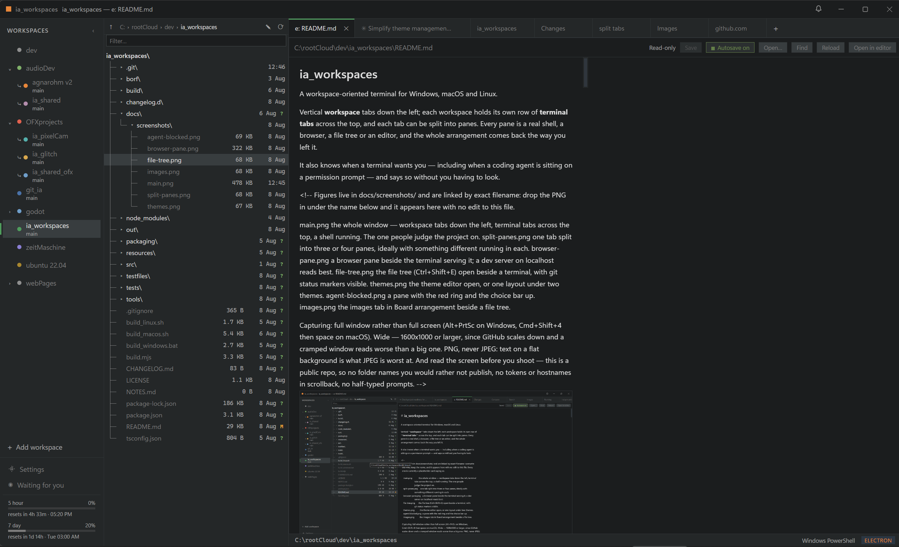

## What it does

- **Workspaces.** Add, rename (double-click or `F2`), recolour, reorder by
  dragging, remove. A workspace is a named group of terminals; it doesn't
  require a folder, though you can point one at a folder from the right-click
  menu. Workspaces nest, and the glyph that marks a nested one is yours to
  choose.

  What each row shows is on the sidebar's own right-click, under *Sidebar
  shows*: git branch, tab count, tokens spent.
- **Tabs and split panes.** Split any tab left/right or up/down, drag the
  dividers to resize, `Alt`+arrows to move between panes. Each pane is its own
  shell. Drag a tab onto a pane's edge to fold it in as a split — it brings
  everything it held, still arranged as it was, shells still running — and drag
  a pane out onto the tab bar to take that apart again.

  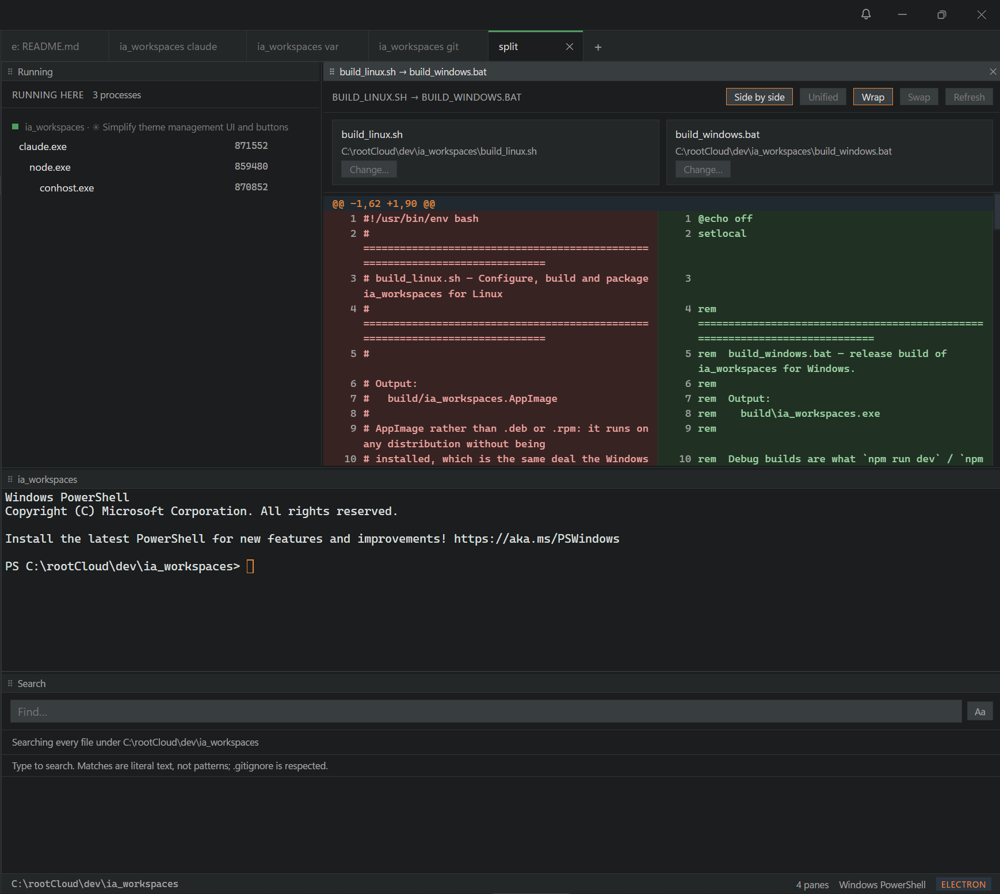

- **A tab is not only a terminal.** Clicking `+` asks what to open rather than
  guessing — fourteen kinds: terminal (`Ctrl+T`), file tree (`Ctrl+Shift+F`),
  editor (`Ctrl+Shift+O`), git (`Ctrl+Shift+D`, holding both Changes and
  History), compare files (`Ctrl+Alt+D`), search (`Ctrl+Shift+S`), images
  (`Ctrl+Shift+G`), running processes (`Ctrl+Shift+R`), token stats, browser
  (`Ctrl+Shift+B`), **Prompts** — every prompt you have ever sent an agent, see
  [What the agent has been doing](#what-the-agent-has-been-doing) — and the four
  below that are about the work rather than the code: **Focus**, **Today** and
  **Canvas**. (The runbook stopped being a tab — it is a view inside the command
  history box now, which is where you were already looking for a command.) A terminal is the first entry and `Ctrl+T` still
  opens one without asking. Each splits beside a shell like any other pane.

  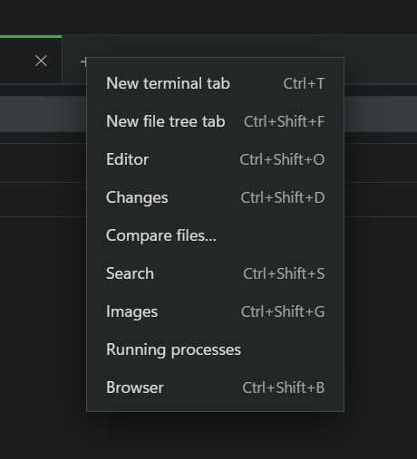

  <!-- screenshot wanted: docs/screenshots/tab-menu.png — the + button’s menu, open, showing the fourteen kinds -->

- **A browser pane** (`Ctrl+Shift+B`), for the dev server the terminal beside
  it is building. Address bar, back/forward, and Ctrl+scroll to zoom. It is a
  `<webview>`, a real DOM element, so the split layout clips, hides and stacks
  it like any other pane.

  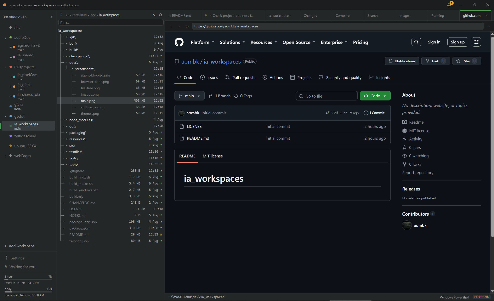

- **The platform's own shell by default** — Windows PowerShell on Windows,
  launched exactly as right-click → *Open in Terminal* does, startup banner and
  all; `zsh` on macOS and `bash` on Linux, as login shells so a Mac gets its
  PATH from `path_helper`. PowerShell 7, `cmd`, WSL, `fish`, `sh` and a custom
  shell are available in Settings and per workspace from its right-click menu.
  A tab already open changes with **Reopen as…** on its own right-click — WSL
  once per installed distribution, SSH once per host in `~/.ssh/config`, plus
  *other host…*. It ends that pane's shell and starts the new one in its place.
  Splitting gives you another of the same shell, on the same distribution or
  host.

  A workspace file written on one platform opens on another: a `powershell`
  pane carried to a Mac falls back down the chain to zsh rather than dying, and
  the recorded value survives, so the file still opens PowerShell back home.

  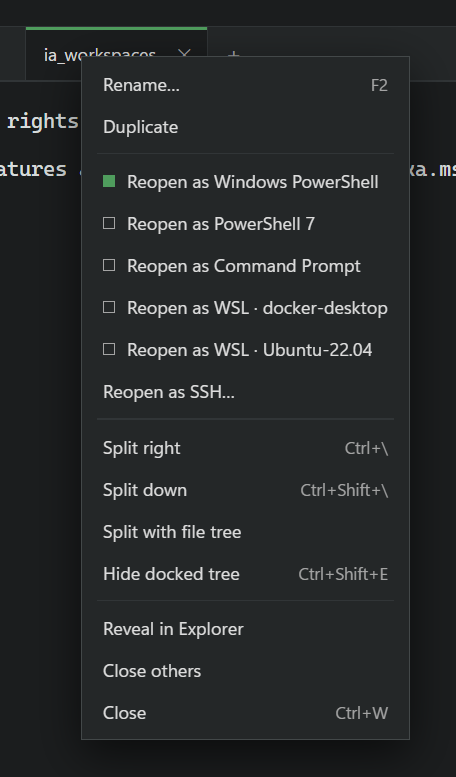

- **An editor** (`Ctrl+Shift+O`) that reads the same file seven ways: markdown
  as you type it, code with its grammar, plain text, rendered markdown, JSON, a
  table for CSV and TSV, and hex. The mode is on the tab's right-click menu and
  is remembered per tab, so the same file can be open as a table in one pane and
  as text in another. Find and replace, line numbers, a column guide, editing
  commands and autosave; the hex view edits bytes in place. A file changed
  underneath you is picked up rather than overwritten, and *Open in external
  editor* hands it to whichever editor you name in Settings.

  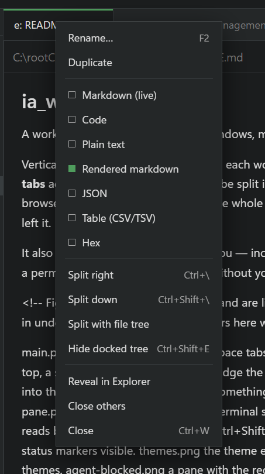

  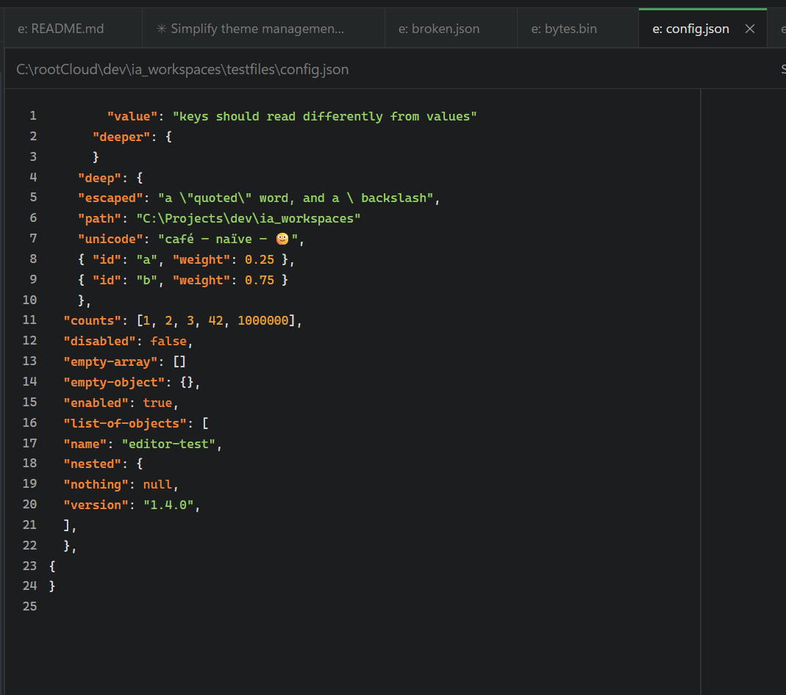

  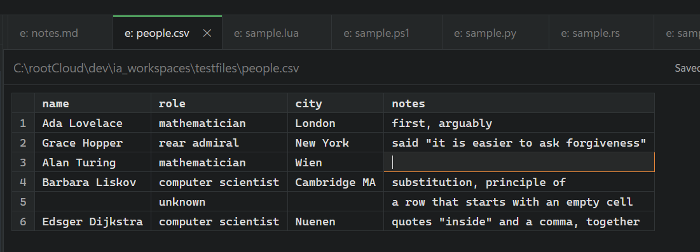

  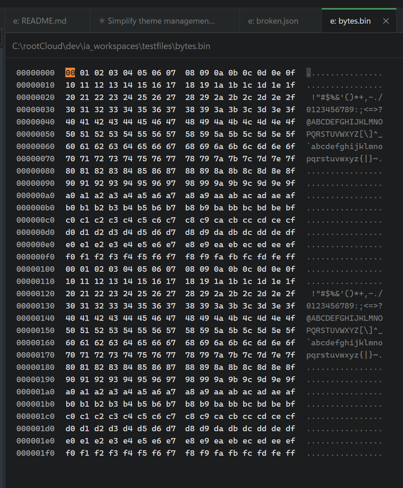

- **Worktrees, for an agent per branch.** Right-click a workspace → *New
  worktree…*, give it a branch, and you get a git worktree beside the
  repository plus a workspace nested under the original sitting in it. There is
  no new concept and nothing new persisted: a worktree is a workspace whose
  folder happens to be one, so the file tree, Changes, search and the branch
  under the name all work on it unchanged. Removing that workspace asks whether
  to remove the worktree too — and if the checkout is dirty git refuses, which
  is reported rather than forced.

- **A Changes tab** (`Ctrl+Shift+D`) — every uncommitted change in the
  workspace's repository, file list on the left and the diff on the right, with
  the same status markers the file tree uses. Tick the files you want and it
  does the three steps: **pick**, **save**, **send**. See [Git, in plain
  words](#git-in-plain-words).

  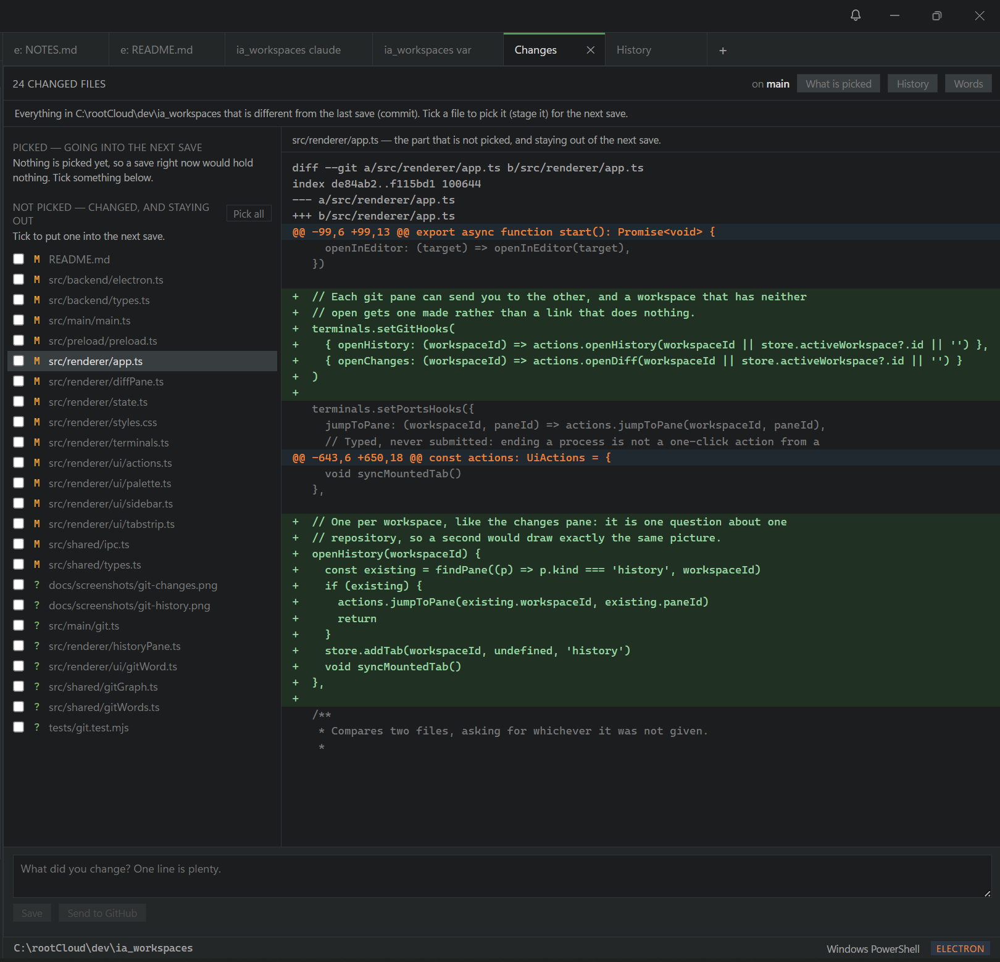

- **A History tab** — every save in the project as the picture of it: a dot per
  save, a coloured line per line of saves, forking where somebody started
  something and rejoining where it came back. Pick a save to read its message
  and its changed lines; the lines of saves are chips along the top, and
  clicking one goes there. It marks the saves that are **only on this machine**.

  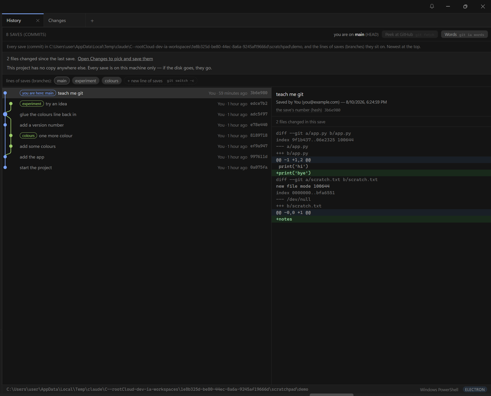

- **Themes** covering both the window chrome and the terminal, with a built-in
  editor: six presets (Graphite, Mono, Ember, Claude, Campbell, PowerShell
  Blue), full control over the 16 ANSI colours, corner rounding, and
  import/export from the editor. Windows Terminal colour schemes can be
  imported directly from its `settings.json`.

  The two halves are chosen separately — a terminal palette from Ghostty or
  Windows Terminal says nothing about a sidebar — so the list is two columns,
  and each has its own editor.

  An interface theme also carries the window and the lettering: opacity down to
  0.3 with the system's backdrop behind it, the **interface font**, its **text
  size**, and an **interface size** that scales padding and controls with it.
  Terminals keep their own font and size. Below full opacity the grid goes
  translucent with the window, and the graphics-card renderer stands down for
  those panes.

  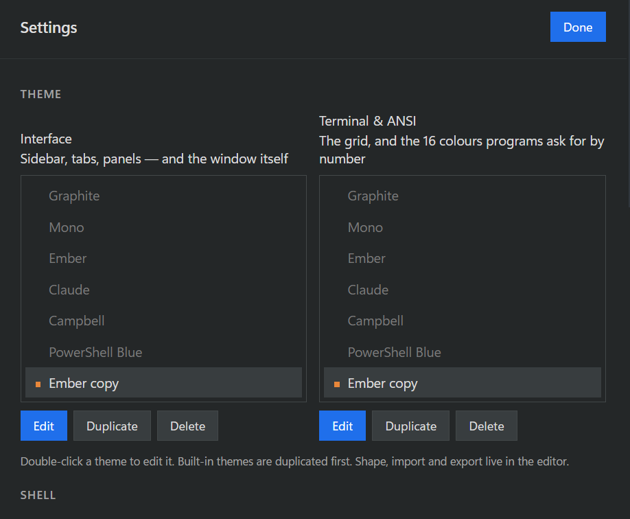

  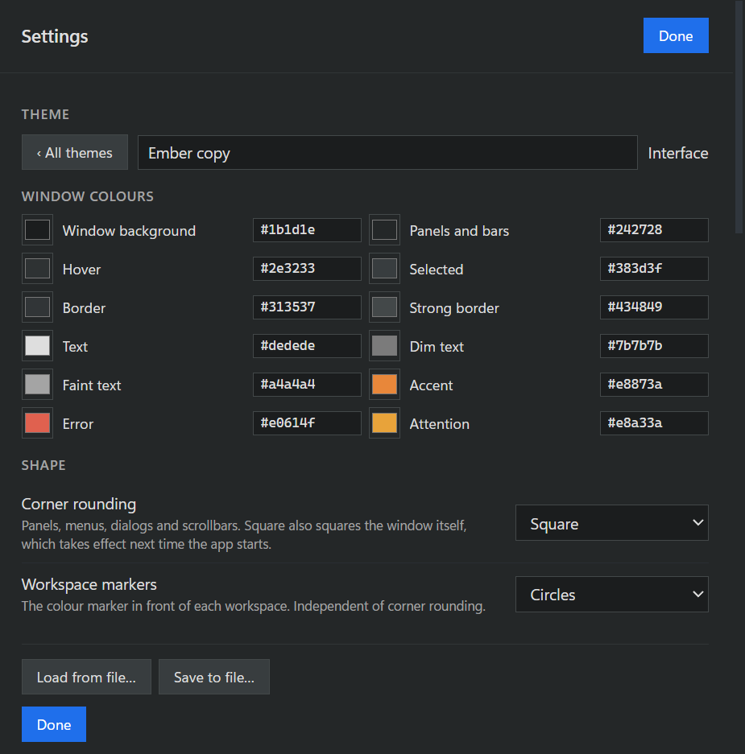

  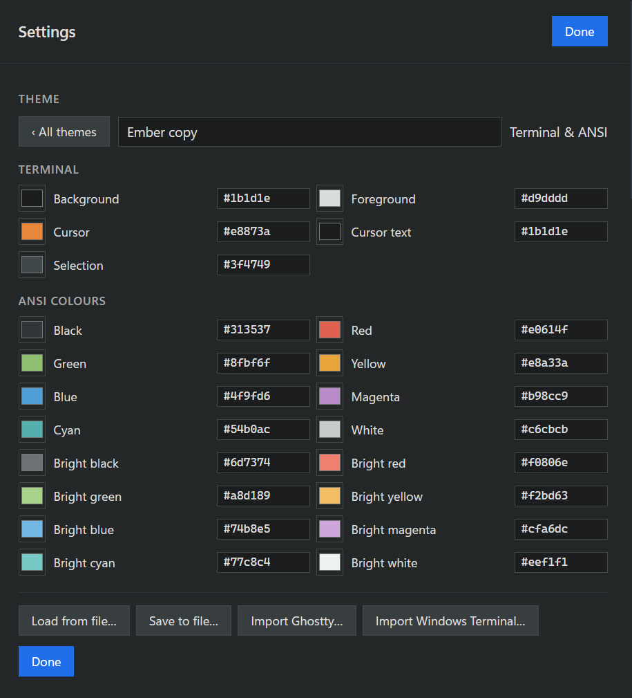

- **An images tab** (`Ctrl+Shift+G`) that follows the file tree — one image
  large, or the whole folder arranged across the canvas as justified rows,
  masonry columns, or a board you can drag things around on. See
  [Images](#images).

  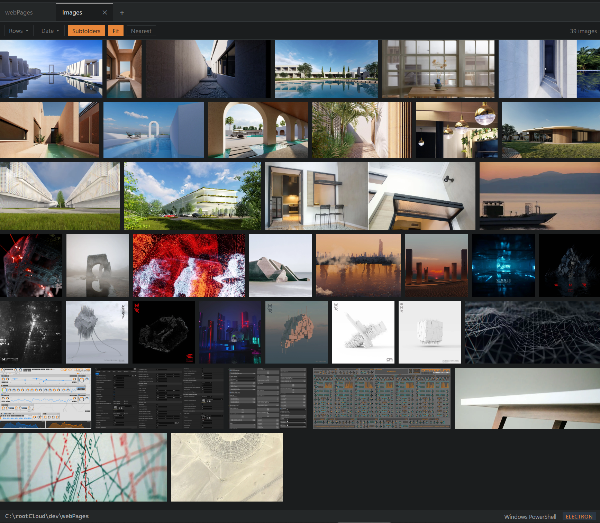

- **A system monitor** that docks to any edge of the window (`Ctrl+Shift+M`).
  Processor load, temperature and memory over one set of axes; a bar per core;
  graphics load, heat and video memory; network throughput with the address each
  interface answers on; per-drive activity, temperature and wear with the volumes
  that sit on them; Claude Code's usage limits; **this app's own processes**;
  battery and uptime; weather and air quality. Right-click it to switch blocks off, and drag any block's heading
  to reorder them.

  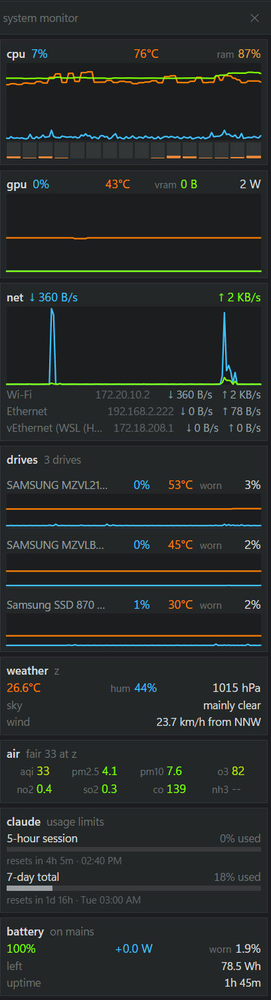

  Everything on it comes from counters the system already keeps: nothing is
  installed, no driver loaded, no administrator asked. That is also why some
  readings are missing — a CPU or drive temperature on Windows needs a signed
  kernel driver, which this app will not ship. Where one is unobtainable the
  block says so rather than showing a plausible zero.

  The block about this app splits its memory by process — main, renderer,
  graphics, utility — because which one is holding it decides what to do about
  it. When the graphics process is holding a few hundred megabytes, the block
  says which setting gives it back.

  Two exceptions, both free. NVIDIA cards answer `nvidia-smi`, which ships with
  the driver, so load, heat and video memory are read there; AMD and Intel
  publish nothing without a sensor driver. And if **LibreHardwareMonitor** is
  running with its web server on (Options → Remote Web Server, port 8085), the
  panel reads its sensors and fills in the processor and drive temperatures — and
  the graphics memory, which `nvidia-smi` reports as zero on a parked laptop
  card. It is never started or installed; absent, nothing happens.
- **Two strips at the foot of the sidebar**, both optional: Claude Code's 5-hour
  and 7-day limits, read with the token it is already signed in with, and four
  lines of how the machine is coping. Usage is on by default, the machine lines
  are off — those cost a small process every few seconds.

- **Token stats per project**, on a tab of their own. What Claude Code has spent
  in this workspace, counted from the conversation transcripts it already writes
  on this machine — nothing is sent anywhere to work it out, and no API key is
  involved.

  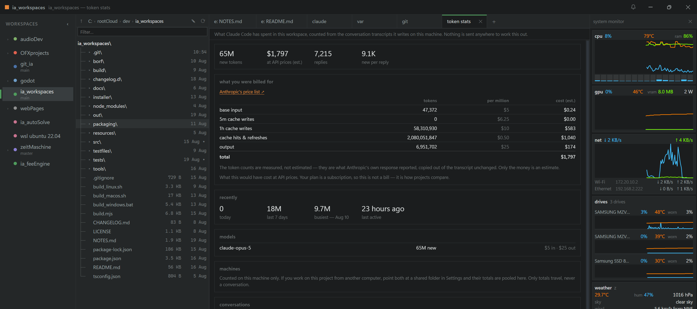

  A row per rate — base input, 5m and 1h cache writes, cache hits, output —
  with its token count, Anthropic's published price per million, and the cost.
  Counts are measured, copied out of the transcript, so only the money is marked
  `(est.)`. No total-tokens figure: base input and cache hits are priced ten
  times apart, so the sum would be true and meaningless. The column that adds up
  is the money.

  Also on the tab: today, this week, the busiest day, when the project was last
  active, which models did the work, every conversation newest first, and each
  folder that counted towards the total.

  Point several machines at a shared folder (Settings → *A folder your machines
  share*, which Relay uses too) and the tab adds them up, a row per machine.
  Projects are matched by git remote, so the same repository lines up wherever it
  lives. Only totals travel, never a conversation.

- **A runbook per project** — the commands you actually run here, taken from
  what has been run rather than from anything you had to write down. Three
  groups: failing now, works but not always, and what you run here. Each row
  says how many times it has run, how many of those failed, what the last one
  exited with and how long it took. Picking one puts it on the prompt without
  running it.

  <!-- screenshot wanted: docs/screenshots/runbook.png — the Runbook tab: failing now, flaky, and what you run here -->

- **Time on each project, counted rather than started** (the **Focus** tab).
  Every time tracker fails the same way — you forget to press the button — so
  this one never asks. Time is counted while a workspace is on screen and the
  window has focus, in stretches of half a minute or more: today, the last seven
  days, the all-time total, and three weeks of daily bars.

  Losing focus stops the clock; a lid closed at six records nothing until you
  come back; clicking through four workspaces is not four sessions. Reading code
  counts — no keystrokes required.

  The same tab holds the project's **to-do list**, which is the checkboxes in its
  own `TODO.md`: write `- [ ] fix the parser` there and it appears here, and
  ticking it rewrites that one line. Beside it, a 25/5 **pomodoro**, which time
  counting does not depend on.

  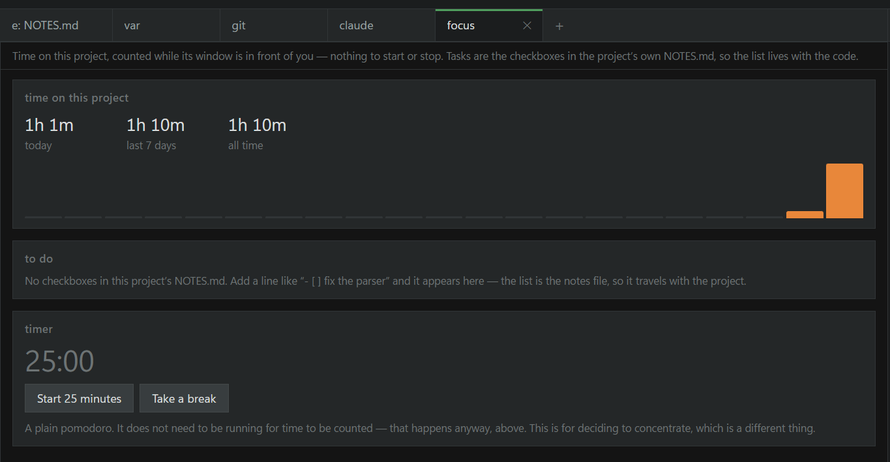

- **Where the day went** (the **Today** tab), across every project rather than
  one: time with each, the commands you ran there, which failed, and what you
  committed. Assembled rather than filled in, and it steps back a day at a time.

  <!-- screenshot wanted: docs/screenshots/today.png — the Today tab across several projects -->

- **Canvases of connected notes** — boxes of words you can move around.
  Double-click to add a note, drag its right edge onto another to connect them,
  drag its corner to resize and double-click that corner to fit the text, wheel
  to zoom, `Ctrl+0` to fit everything. Right-click for groups, links, files and
  colours. `Ctrl+F` searches it with the editor's find bar, lighting every note
  that matches and walking them on Enter.

  **As many per project as you like.** The name in the bar opens new, save as,
  and every canvas the project holds; both ask for a name rather than a file
  dialog, with *Browse…* for one elsewhere. `.canvas` files offer *Open canvas*
  in the file tree. One tab per file, so two panes cannot save over each other.
  A canvas can hold **another canvas**, drawn as a thumbnail you double-click to
  open.

  Saved in the project folder as **[JSON Canvas][jsoncanvas]**, Obsidian's
  format, so the file opens there too and versions with the code. A new canvas
  is untitled and asks for a name the first time you save it — no file appears
  in the project until you have said what it should be called. Node types this pane does not create are kept and
  written back untouched, and note text is markdown — headings, lists,
  `[[links]]`, mermaid.

  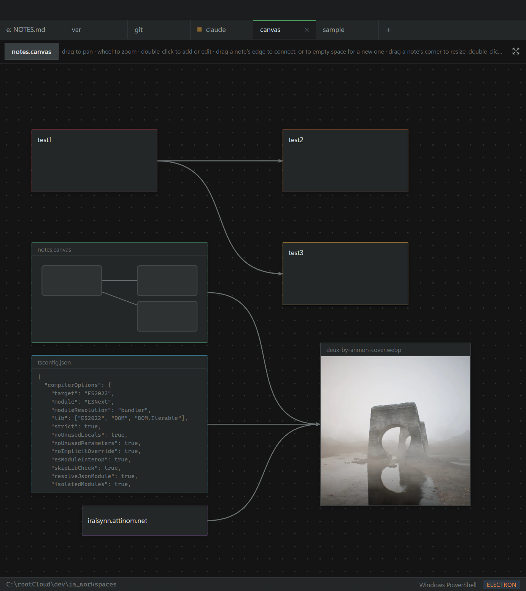

- **Flowcharts written as text.** A ```` ```mermaid ```` fence in any markdown file is
  drawn as a diagram in the reader and editor panes:

  ```
  flowchart TD
    A[Start] --> B{Works?}
    B -->|yes| C([Ship])
    B -->|no| D[Fix it]
    D --> A
  ```

  Boxes, rounded boxes, stadiums, diamonds and circles; solid, dotted and thick
  lines, with or without arrows, labelled either of mermaid's two ways; top-down
  or left-to-right. Written rather than depended on — mermaid itself is a
  megabyte and dozens of transitive packages, in a project whose entire runtime
  dependency list is one terminal library, and the diagrams people draw beside
  code use a small corner of it. Diagrams are text, so they diff, merge and
  travel with the repository, and they take the theme's own colours rather than
  being a picture that is wrong in half of them. What it cannot draw —
  subgraphs, styling directives, sequence diagrams — it refuses outright and
  leaves as code, because a diagram silently missing a box is worse than the text
  it replaced.

  <!-- screenshot wanted: docs/screenshots/flowchart.png — a mermaid fence drawn in the editor pane -->

- **`[[wikilinks]]` and backlinks** in markdown. `[[the build script]]` opens
  `the-build-script.md` beside it, and under every document sits the list of
  other notes that link *to* it — the half of a wiki that makes one worth
  keeping, since a link written in March is only useful in June if the thing
  linked to knows about it. A link that matches nothing says so rather than
  creating a file nobody meant to make.

- **PDFs, read where the notes are read.** Right-click one in the file tree —
  *Open PDF* — and it opens in the reader beside what you were looking at: a
  datasheet, a spec, a drawing set, the things you read next to the code rather
  than edit, which is what that pane was already for. The engine owns a PDF
  viewer, so the pane's whole job is to point it at the file and get out of the
  way — the pages, the toolbar and the find bar in it are Chromium's, not a
  second set of ours. **Reload** genuinely re-fetches, which matters for a file
  that is generated rather than written: a drawing set rebuilt ten seconds ago
  comes back as the new one rather than as this morning's draft. *Edit*, on the
  same menu, still opens a `.pdf` in the hex view, because reading the header of
  a file that will not open is a real thing to want from a file tree.

  The file is streamed to the pane rather than read into it, so a
  hundred-megabyte drawing set costs the renderer no more than a note does. It
  travels over a scheme of its own; [Images](#images) explains why a scheme has
  to exist at all, and why this is a second one.

  <!-- screenshot wanted: docs/screenshots/reader-pdf.png — a PDF open in the reader, split beside the file tree it was opened from -->

- **Knowing what your other machines are up to** (**Relay**). Working on one
  project from a laptop, a desktop and another machine through the same day, the
  question that will not go away is *did I leave something uncommitted on the
  other one?* — and no repository can answer it, because it knows what this
  machine has done to it and nothing about what a machine three rooms away has.

  So each machine writes down its own answer in the folder they already share,
  and a workspace gets a warning triangle when another machine has unpushed
  commits (saves not sent) or uncommitted files (changed, not saved) in it.
  Hovering names the machine, the commits, the files and how long ago it
  reported. Nothing is marked when everything is committed and pushed: a badge
  that appears on every row is a badge nobody reads.

  **It reports and does nothing else** — no git operation runs on your behalf.
  What travels is a description: branch names, counts, and the paths of files
  git already tracks. Never a file's contents, and never an untracked path. A
  project nobody has touched writes nothing.

  <!-- screenshot wanted: docs/screenshots/relay.png — Relay: what another machine is part-way through -->

- **Command history that is yours, not the shell's** (`Ctrl+Alt+H`, or a pane's
  right-click menu). It survives the shell exiting, knows which pane and which
  project each line came from, and records what each one exited with — so the
  box says *failed last time (exit 1)* or *worked last time, failed 2 of 7*
  beside where it ran. An outcome that was never reported says nothing at all
  rather than claiming success.

  Up and Down at a prompt walk it. A control in each terminal's top-right corner
  switches the slice: **this terminal**, **this machine**, or **everywhere** —
  the last recalling commands from your other machines in the same project.

  The search box has a fourth view: the **runbook** — not "what did I run, most
  recent first" but *what does this project actually run, worst first*. Commands
  that failed last time lead, then ones that fail sometimes, then the ones you
  lean on most, each with how it has been going (`failed (exit 1) · 12 times ·
  4.2s`). It used to be a tab, which meant the answer to a question about
  commands lived somewhere other than the box you open to look for a command.

  The choice **sticks**. It is saved with the pane, so it survives a restart,
  and the last ring you picked becomes the one new terminals start on — flipping
  the switch says both "this pane" and "and from now on". A pane you set
  differently keeps its own setting, because it has one. It ships on *this
  terminal*: the widest ring is the most impressive default and the least useful
  one, since what you nearly always want from the Up arrow is the thing you just
  ran here. Where
  the shell can bind its own arrows (PowerShell, pwsh, bash, zsh) the binding
  lives there, so its own line editor replaces its own line; elsewhere the app
  types it in. The ⌕ beside the switch searches the same slice.

  Sharing commands between machines is off by default and inert without a
  passphrase — a command line carries tokens and connection strings, and a
  synced folder keeps history that outlives any deletion. Commands are stripped
  of the obvious secret shapes, then encrypted with AES-256-GCM under a
  passphrase typed on each machine; the folder only ever holds ciphertext. What
  that does not hide is stated beside the setting. With sharing off, the
  passphrase greys out and *everywhere* is struck through on every switch.

  <!-- screenshot wanted: docs/screenshots/command-history.png — the history overlay on a pane -->

- **Dragging a file out of the app** hands other programs the file itself, so a
  row from the tree can be dropped into an upload, onto a message, or into a
  mail attachment. Settings → Behaviour chooses between the file, its location
  as text, or the default: the file unless it lives inside WSL, where a
  Windows-shaped path is not one another program could open. Dropping onto this
  app's own panes works as it always did.

- **Remembers everything.** Workspaces, their names, folders and colours; every
  tab, its pane layout, and the folder each pane was last in; which tab was
  selected; window size; all settings and custom themes. Written so that losing
  power does not lose the file: a temporary file, flushed to the disk, a copy of
  the version it replaces, and only then the rename.
- **Saves workspaces to a file you keep.** Right-click a workspace → *Save
  workspace…* (it and anything nested under it), *Save all workspaces…*, or
  *Load workspaces…*. Layout only — names, folders, colours, shells, tabs and
  the split tree — so a file is a couple of kilobytes, reads cleanly in an
  editor, and can be committed next to the code it opens. Loading adds beside
  what is already open and never replaces it.
- **Shells outlive the app.** The pseudo-terminals are owned by a small
  background process — the *session broker* — not by the window. Quit
  ia_workspaces with a build running, an SSH session open or an agent
  mid-answer, reopen it, and you are back in the same shells with the same
  processes still running, not looking at a picture of them. Closing a pane is
  the one action that ends a shell, which is the point: it is the only place
  work is thrown away, and it stays deliberate. See
  [The session broker](#the-session-broker).
- **Remembers what each pane was showing.** For the case a broker cannot cover —
  a machine restart, which ends every process on it — a reopened pane still
  replays its last screen before its new shell starts. The build output or stack
  trace you were reading is there even when the process behind it is not.
  Settings → Behaviour turns it off.
- **Transcripts of panes you have closed** (`Ctrl+Alt+V`). Closing a pane used
  to delete its scrollback outright — right for the buffer, which exists to
  restore a pane that is not coming back, and wrong for the content. Now it is
  written to a text file first. There is no new pane to learn: picking one opens
  it in the editor, which already has find, and the last entry points the search
  pane at the whole folder. The newest 200 are kept.
- **Gives back the buffer of a pane you stopped looking at** (Settings →
  Behaviour → *Scrollback kept for panes you are not looking at*). A pane that
  once printed ten thousand lines holds them until you close it — around
  twenty-four megabytes at a wide window. After half an hour off screen it is
  cut back to this many lines, which genuinely discards them; 0 never trims.

- **Gives an idle agent's memory back** (Settings → Behaviour → *Release an idle
  agent's shell after*). A Claude Code pane at its prompt holds around half a
  gigabyte, plus an MCP server and a console host of its own. Set a number of
  minutes and a pane off screen that long ends its shell: it keeps its screen and
  says so, and the next key you press resumes the conversation with
  `claude --resume`. Only agent panes, never one that is working, waiting on an
  answer, or on screen. Off by default — it ends processes.

  <!-- screenshot wanted: docs/screenshots/idle-agent.png — a released pane saying so, before a key wakes it -->

- **"Open in ia_workspaces" on a folder's right-click** in the file manager
  (Settings → Behaviour; Windows only, written to `HKCU`, no administrator
  needed). The folder opens as a workspace.

- **Looks for a newer release once at startup** and says so in the app. A
  network call made without being asked, so it is a switch.

- **Tells you when a terminal needs you** — desktop notification when the window
  is in the background, in-app toast when it isn't, a chime, a ring around the
  pane, a dot on the tab and workspace, and a notification panel (`Ctrl+I`) with
  unread tracking.

## Running it

Node 20 or newer, and a C toolchain for the PTY module if your platform has no
prebuilt binary.

```bash
git clone https://github.com/aombk/ia_workspaces.git
cd ia_workspaces
npm install
npm start          # build and run
```

```bash
npm run dev        # the same, rebuilding as you edit
npm test           # bundles the real TypeScript and exercises it
npm run typecheck
```

## Building a release

One script per platform, same arguments:

```bat
build_windows.bat            :: portable .exe + installer
build_windows.bat --clean    :: wipe out\ first
set SKIP_INSTALLER=1         :: portable only, for fast iteration
```

```bash
./build_macos.sh             # signs, notarizes and staples a universal .dmg, plus a .pkg
./build_macos.sh --test      # unsigned, for this machine only
./build_linux.sh             # AppImage, plus a tar.gz with an install script
```

Each platform produces **two** artifacts, and they answer different questions.
The **portable** build is one file that runs without installing — a stick, a
machine you do not own, five minutes with the thing. The **installer** is for a
machine you keep: a fixed path, a menu entry, an uninstaller.

| | Portable | Installer |
| --- | --- | --- |
| Windows | `ia_workspaces.exe` | `ia_workspaces-setup.exe` — Inno Setup |
| macOS | `ia_workspaces.dmg` | `ia_workspaces.pkg` — `productbuild` |
| Linux | `ia_workspaces.AppImage` | `ia_workspaces-linux.tar.gz` + `install-linux.sh` |

Every installer offers a choice of destination and defaults to a per-user path,
so none of them needs an administrator to run:

| | Just me (default) | All users |
| --- | --- | --- |
| Windows | `%LOCALAPPDATA%\Programs\iraisynn_attinom\ia_workspaces` | `C:\Program Files\iraisynn_attinom\ia_workspaces` |
| macOS | `~/Applications/iraisynn attinom/` | `/Applications/iraisynn attinom/` |
| Linux | `~/.local/share/iraisynn_attinom/ia_workspaces` | `/opt/iraisynn_attinom/ia_workspaces` |

On Windows the choice is the first page of the wizard and the directory page is
left in, so any other path works too. On macOS it is the installer's own
destination page. On Linux the script asks, and then offers to take a path of
your own.

None of them touches what the app remembers: workspaces, settings, themes and
scrollback live in your user profile, so installing over an existing copy keeps
them and uninstalling asks before removing them.

The Windows installer needs [Inno Setup](https://jrsoftware.org/isdl.php) 6.6 or
newer on the build machine — the same compiler the rest of the range is built
with, so one wizard style and one publisher folder across all of it. Without it
the build still produces the portable exe and says what it skipped.

Windows and Linux builds need nothing but the toolchain. macOS signing needs an
Apple Developer account, and `build_macos.sh` takes the identity from the
environment rather than from anything committed here:

| Variable | Meaning |
| --- | --- |
| `APPLE_TEAM_ID` | Your 10-character team id. Required to sign. |
| `APPLE_SIGN_ID` | The certificate's common name, if it isn't the default form. |
| `NOTARYTOOL_PROFILE` | The `notarytool` keychain profile to notarize with (default `notar`). |

It checks for both the certificate and the profile before starting the slow
part rather than an hour in. `--test` skips signing entirely, which produces
something Gatekeeper will refuse anywhere but the machine that built it.

Each script typechecks and runs the tests before building anything, then
gathers the artifact into `build/`, clearing anything else it finds there so the
folder only ever holds what the last run produced. The individual steps are
still available:

```bash
npm run package      # build and package for this platform
npm run collect      # re-gather the artifact without rebuilding
npm run clean        # delete out/ and build/
```

### Where things land

Each toolchain wants its own output location, so they're all pointed at one
place and the shippable files are gathered afterwards:

```
out/                  every intermediate — safe to delete at any time
  electron/           esbuild bundle that `npm start` runs
  electron-pack/      electron-builder staging
  installer/          Inno Setup / productbuild / tar.gz output
build/                the only folder with finished artifacts
  ia_workspaces.exe            ~90 MB, portable     (Windows)
  ia_workspaces-setup.exe      ~100 MB, installer   (Windows)
  ia_workspaces.dmg            ~240 MB, universal, signed and notarized (macOS)
  ia_workspaces.pkg            ~240 MB, universal, installer            (macOS)
  ia_workspaces.AppImage       portable             (Linux)
  ia_workspaces-linux.tar.gz   installer            (Linux)
```

Windows is the one platform whose deliverable is a bare executable. A macOS
`.app` is a directory that will not run if you take the binary out of it, and a
Linux build needs its libraries gathered around it — so on both, the deliverable
is the disk image or AppImage, and that is what `collect.mjs` gathers.

Both `out/` and `build/` are gitignored.

### The version

`package.json` — that one field, and nothing else. electron-builder reads it,
and `tools/collect.mjs` reads it for the file names electron-builder produces.

### One packaging caveat

`electron-builder` downloads a code-signing toolchain containing macOS symlinks,
and extracting those on Windows needs a privilege a normal user account lacks.
It treats the failure as fatal even though the symlinks are irrelevant here.
`"signAndEditExecutable": false` works around it — but that same flag is what
stamps the icon and version info onto the exe, so the packaged
`ia_workspaces.exe` used to report itself as "Electron 43.2.0" and wear
Electron's icon.

`tools/stampExe.mjs` now does that half of the job on its own, as an `afterPack`
hook: `rcedit` needs none of the signing toolchain, so the exe comes out branded
without Developer Mode. Nothing here signs anything; enabling **Windows
Developer Mode**, deleting `%LOCALAPPDATA%\electron-builder\Cache\winCodeSign`
and dropping the flag is still the way to get signing back should it ever be
wanted.

The window also carries the icon at runtime (`build.extraResources` ships the
`.ico` beside the asar), so the taskbar and Alt+Tab are right whatever state the
executable is in.

### Publishing a release

A GitHub release is a git tag with files attached to it. `npm run release` does
both, taking the version from `package.json` — never from an argument, because a
version typed on a command line is one that can disagree with the binaries
sitting in `build/`.

Four steps, and only the first is typed by hand:

```bash
# 1. bump "version" in package.json — the only place a version is written
npm run changelog        # folds changelog.d/ into CHANGELOG.md under that version
git commit -am "1.1.0" && git push

# 2. build, on each machine that can sign for its platform
build_windows.bat        # or ./build_macos.sh on the Mac

# 3. publish
npm run release          # tag v1.1.0, push it, create the release with build/* on it
```

`build_windows.bat` builds and nothing else — it typechecks, tests, packages and
gathers into `build/`. It does not tag, push or publish, and `npm run release`
does not build. Keeping them apart is what lets the Mac's artifacts join a
release the Windows machine already made.

It refuses before it writes anything: the GitHub CLI has to be installed
(`winget install GitHub.cli`, then `gh auth login` once) and signed in, the tree
has to be clean, `HEAD` has to be on `origin`, `build/` has to have something in
it, and `CHANGELOG.md` has to have a section for the version — which is what
becomes the release notes. An artifact older than the commit being tagged is
called out, since that one is silent otherwise: it uploads, it installs, and it
is not the code in the release.

The **second platform** needs no different command. macOS builds on the Mac that
can sign and notarize it, and running `npm run release` there finds the release
already exists and uploads into it rather than creating a second one.

```bash
npm run release -- --dry-run   # say what it would do, touch nothing
npm run release -- --draft     # create it unpublished, to look at first
npm run release -- --assets    # upload build/ into an existing release only
```

**The in-app check reads the same releases.** `main/updates.ts` asks
`/repos/aombk/ia_workspaces/releases/latest` for its `tag_name`, strips the `v`,
and `shared/version.ts` compares it with the running version — field by field as
numbers, so 1.10.0 is after 1.9.0. Unauthenticated, so sixty checks an hour per
address, which is sixty launches. Nothing is downloaded and nothing installs
itself: a newer version is a toast that offers to open the release page, and
Settings → About has the same check on a button. A repository with nothing
published yet reads as "no update source configured" rather than as an error,
because that is what it is.

## File tree

`Ctrl+Shift+E` opens a file tree beside the current tab, rooted at the active
pane's folder. It is deliberately not a file manager — your system's file
browser already exists and is one click away. What it adds is the part that
cannot do:

- **New terminal here** from any folder, as a split beside the tree
- **Drag a row onto a terminal** to insert its quoted path at the cursor
- Git status markers per file, and on folders containing changes
- Breadcrumbs, expandable folders, hidden-file toggle, copy path
- Sort by name, size, date modified or type, either direction — folders stay on top
- Size and modified-date columns, each switched on separately, for the times the
  name is not the thing you are picking by
- **Multiple selection**, and **cut, copy and paste** between trees
- **Drag a row onto a folder** to move it there, in this tree or another one.
  The target folder is outlined, a closed one opens if you rest on it, and what
  moved is named in a toast you can click to put it back. Dropping on the space
  below the rows, or on the root row, moves things up to the folder the tree is
  standing in. Only rows from a tree — a file dragged in from Explorer or Finder
  is not moved.

| | |
| --- | --- |
| click | select one |
| `Ctrl` click | add or remove one |
| `Shift` click | everything between, from the last plain click |
| `Ctrl` `A` | everything on screen |
| `Ctrl` `X` / `C` / `V` | cut / copy / paste |
| `Del` | delete, with one confirmation for the lot |
| `Esc` | drop the selection |
| drag onto a folder | move it there |

Every action takes the whole selection: cut, copy, delete, **Send paths to
terminal**, and dragging onto a shell — where five files arrive as five quoted
arguments. Right-clicking a row *outside* the selection acts on that row alone
rather than clearing what you had, so the menu always says what it is about to
do: *Copy 4 items*, *Delete 4 items…*.

Pasting never overwrites: a name already in use gains a `(2)`, which is what
makes copy-and-paste into the same folder mean *duplicate*. Cut rows are faded
until they land, and the clipboard is shared by every tree, so copying in one
and pasting in another works. It is not the system clipboard — reading a file
list from that needs a raw `CF_HDROP` on Windows and a different format on every
other platform, none of which the host exposes — so Explorer stays one **Reveal
in Explorer** away for anything crossing the boundary.

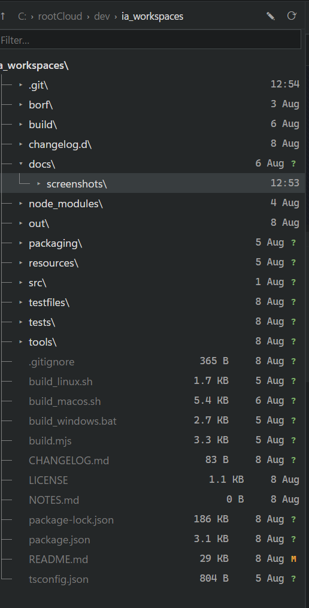

## Images

`Ctrl+Shift+G` opens an images tab, showing whatever the file tree is pointed
at. It is a view onto where you already are, not something you open a file into,
so one click is the whole gesture:

| Click in the tree | The images tab shows |
| --- | --- |
| an image | that image, large |
| a **folder** | every image in it — no need to open the folder first |
| any other file | the images in the folder the tree is showing |
| nothing, or navigate | the images in the folder the tree is showing |

Selecting a folder is the one worth calling out. Every other pane that watches
the tree treats a folder as something to *open*, because opening is what those
panes do with it; there is nothing to open here, so a single click on a folder
simply fills the gallery with it. Navigating into it changes nothing about what
you see.

Three arrangements:

| | |
| --- | --- |
| **Rows** | Every row spans the full width, nothing cropped, order reads left to right. The contact sheet. |
| **Columns** | Fixed-width masonry, for a folder that is mostly tall images. |
| **Board** | Shelves of varied height and offset, packed to fill the canvas rather than to line up. Drag to move, drag the corner to resize. |

Order by name, size, date or at random, either direction. The name sort is
numeric, so `img2` comes before `img10`. **Subfolders** widens the gallery to
everything beneath the folder; **Fit** shrinks the arrangement until all of it
fits without scrolling.

**Nearest** switches resampling from smooth to nearest-neighbour, for pixel art.
Not a stylistic preference: blowing up a 32×32 sprite with the default filter
turns every hard edge into a blur, which is exactly the thing you zoomed in to
look at. It applies to the gallery and the enlarged image alike.

Right-click an image to maximize it, open it in the system viewer, show it in
the file tree or in Explorer, copy its path or name, rename it, or delete it. On
the board there is also **Bring to front**, and **Reset position** to put one
image back where the packing wants it without disturbing the rest of what you
have arranged.

**Maximize** — or double-click — fills the pane with one image. Its bar carries
previous, next and delete; each also has a key, and neither is the real one:

| | |
| --- | --- |
| `←` `→` | previous / next, in the order the gallery is sorted |
| `Del` | delete, behind the same confirmation as the menu |
| `Esc` | back to the gallery (or click the backdrop) |
| scroll | zoom, about the pointer |
| drag | pan, once zoomed in |
| double-click | 2× at that point, again to fit |

Scrolling zooms rather than scrolling, because a fitted image has nothing to
scroll — and it zooms about the pointer, so the detail you are aiming at stays
under it instead of sliding away. `Ctrl` `0` fits again. A new image always
starts fitted: a zoom belongs to the picture in front of you, and carrying it to
the next one lands you somewhere arbitrary in a photograph of another shape.

Deleting from the viewer stays in the viewer and moves to whatever took that
image's place, which is what clearing out a folder wants, and drops back to the
gallery when there is nothing left.

Random is seeded, and the seed is kept. The gallery re-solves its layout on
every app render, so an unseeded shuffle would deal a new hand each time and the
pictures would never hold still — instead the order is a pure function of a seed
that survives a restart, and **Shuffle** is how you ask for a different one. The
board works the same way: the packing is deterministic, and anything you drag is
recorded against it in fractions of the canvas, so resizing the pane keeps the
arrangement rather than pushing half of it out of view. Only what you moved
yourself is stored, so a board you never touched costs nothing in the workspace
file.

Images reach the page over a scheme of their own, `iaw-img:`. The renderer is a
`file://` document and Chromium gives it an opaque origin, so `img-src 'self'`
does not cover other files on disk and an `` pointed at a photograph is
blocked. Reading the bytes over IPC into a `data:` URL is the other obvious
route and does not survive real images — it would cap at a megabyte, cost a
third again in base64, and hold a whole folder in the JS heap as strings. The
scheme streams the file instead, so decoding and caching are Chromium's and a
60 MB panorama costs no more renderer memory than a thumbnail. `img-src` gains
that one scheme and nothing else.

The reader's PDFs arrive the same way and over a second scheme, `iaw-doc:`,
rather than a wider first one. The two are granted by different CSP directives —
an image by `img-src`, an embedded document by `object-src` — so carrying both
on `iaw-img:` would mean naming that scheme in both, and every `` on the
page would then be one injected tag away from being an embedded plugin document.
Two schemes keep the two grants apart. Streaming matters more here than it does
for images, not less: a drawing set is routinely a hundred megabytes, and the
`data:` route would base64 the lot through IPC into the JS heap before the first
page appeared.

## Git, in plain words

Two panes, answering the two different questions. **Changes** is "what is
different right now, and how do I keep it". **History** is "what has happened,
and where am I in it". Both speak the same way, and that is the point of them.

### The three steps, kept as three

```
pick (stage)  →  save (commit)  →  send (push)
```

Each is its own motion behind its own gate, in that order. Tick the files to
pick them; write a line and save; send when you mean to. There is no button that
does two of them, deliberately: the whole confusion about git is that those
three are three and not one — *picked* is not *saved*, and *saved* is not *on
GitHub* — and a "Commit and push" button teaches the opposite of the only thing
you have to understand.

So the pane keeps them apart everywhere. Files are in two groups, **picked** and
**not picked**, and a file can be in both at once — pick it, edit it again, and
part of it is going into the next save while part of it is not, which is what
git means by two status columns and what a single letter would quietly lie
about. The diff pane shows one half at a time and says which. After a save the
toast says GitHub has not got it yet.

### Both languages, at the same time

*Picked (staged) — going into the next save*. *Not picked (not staged)*. *8
saves (commits)*. *You are on main (HEAD)*. *Lines of saves (branches)*. In
brackets, in the heading, on screen — not in a tooltip. A word you have to hover
for is a word you never learn; hovering is for the whole explanation, and there
is a panel with all of them (**Words** in either pane's header, or "Git words,
in plain words" in the palette).

And every button carries the command it runs, dim and in monospace beside its
label:

| the button | what it runs |
| --- | --- |
| Pick all | `git add -A` |
| Unpick all | `git reset` |
| Save 2 picked files | `git commit` |
| Send to GitHub | `git push` |
| Bring in GitHub's saves | `git pull --rebase` |
| Peek at GitHub | `git fetch` |
| + new line of saves | `git switch -c` |

That is the half of the vocabulary you eventually have to type, and there is
exactly one moment you are guaranteed to care what `git commit` means: the
moment you are about to press the button that does it. `git_ia` does the same
thing at the prompt — print the command, then ask.

One rule, and it is the rule that makes the difference: **never explain jargon
with jargon.** Every git word appearing inside another word's explanation is
itself translated on the spot, because a glossary that defines "commit" in terms
of "the index" is a closed loop with extra steps.

The alternative was to hide git's vocabulary behind friendly buttons, which is
what most git clients do, and it produces somebody who can use that one client
and cannot read a single sentence git prints or follow a single answer online.
The vocabulary is [`git_ia`](https://github.com/aombk/git_ia)'s.

### The picture

A dot per save, a coloured line per line of saves, worked out from which saves
came before which — the shape is not stored anywhere, so it has to be derived
(`src/shared/gitGraph.ts`, which is arithmetic and has its own tests). A line
that splits is somebody starting from where you were; two lines meeting is that
work coming back. Nobody has to be told that, which is why every git client
draws it.

What this one adds is the badge: **this machine only**, on every save that is on
no line GitHub has. Not "ahead of my upstream" — a save on a branch you are not
standing on is just as absent, and the count in the headline would never mention
it. "Have I actually sent this" is the thing people get wrong about git more
than anything else, and no client answers it out loud.

### When git says no

The plain sentence and git's own message, together, never one instead of the
other. A refused push explains that GitHub has saves you do not, that pushing
would mean GitHub throwing its own away, that git is protecting you, that
nothing is lost, and what to do next. Missing credentials, an unset name and
email, a conflict, a branch that would be overwritten, a stopped rebase and a
lock held by another git process get the same.

Git's text stays because it is the text that matches every answer written about
it anywhere. A pane that hides it is a dead end.

### What these panes will not do

No discard, no undo of a save, no `reset --hard`, no force push, no deleting a
branch. The worst outcome of any button here is a save you did not mean to
make — which you can then undo. That is a deliberate ceiling: a pane you can
press every button in without fear is worth more than a complete one, and the
operations that bin work are one pane away in a terminal, where they read as
what they are.

Both panes also refuse while a rebase or a merge has stopped part-way, and say
so. A save made in the middle of one of those means something other than what
the button says.

Git runs with `GIT_TERMINAL_PROMPT=0`, so it can never stop and ask a process
with no terminal behind it for a password — it fails immediately and the pane
explains that it needs you to sign in once from the shell beside it.

## Knowing which pane needs you

Six signals feed one alert pipeline, and they answer two different questions.
What comes out of it: a desktop notification when the window is in the
background, an in-app toast when it isn't, a chime, a ring around the pane, a dot
on the tab and the workspace, and a count on the bell that clears when you read
the panel behind it (`Ctrl+I`).

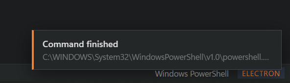

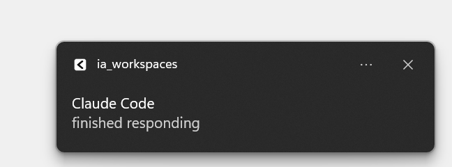

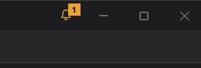

**Is this pane busy?** Output volume alone decides. A pane that emits a sustained
burst is *active*; when the bytes stop it is *idle*. Nothing is pattern-matched,
so this works identically for Claude Code, a webpack watch, and `cmd.exe` — which
has no shell integration at all. A submitted line also opens a turn, so a short
reply that never reaches the byte threshold still counts.

**Why did it stop?** Volume cannot tell you, and that is the difference that
matters: an agent that finished and an agent stopped on a permission prompt both
go silent. So the agent says so itself.

```bash
iaw report-agent --blocked "permission: Bash(rm -rf build)" --choices @choices.json
iaw report-agent --run-start          # a turn began; the count nests
iaw report-agent --unblocked          # the human answered
iaw report-agent --progress 45        # how far through this turn it is
iaw report-agent --failed             # this turn ended badly  (--ok clears it)
iaw agent-state                       # every pane, as JSON
```

**How far through?** `--progress` draws a two-pixel line along the top of the
pane. Declared, never inferred: nothing here can know what fraction of a job is
done, and a bar this app invented would be a guess wearing the clothes of a
measurement. It goes stale on the same one-minute rule as the other metadata,
because a bar frozen at 60% for an hour looks more maintained than no bar at
all.

**Did it work?** `--failed` is the state the other three could not express: an
agent that finished and an agent that fell over both stop producing output and
both drop to a depth of zero, so without being told they look identical. It
marks the tab with a still red dot — a question pulses, a verdict waits, and
telling them apart by movement rather than hue survives a colour-blind reader
and a dimmed screen. The next `--run-start` clears it, because a new turn makes
the last one's failure history.

A blocked pane gets a red ring and a bar carrying the answers that agent
published. Clicking one types it in.

The app never composes a payload of its own — it does not know how to answer a
Claude Code permission prompt or somebody's custom menu, and the moment it
guessed it would own a dependency on their UI not changing. So it is a relay: the
agent declares both the label you read and the exact bytes that pick it, the
relay refuses unless that pane currently says it is blocked, and **answering does
not clear the blocked flag** — the agent confirms that itself, or one mis-declared
key would leave a stuck pane looking answered forever.

**Which agents this works with.** The protocol above is deliberately
tool-agnostic — anything that can run a command can declare itself, and the
activity detection needs no cooperation at all — but **Claude Code is the only
agent it has been tested against.** What that means in practice:

- The **hook installer** in Settings covers Claude Code and, under *Other
  agents*, Gemini CLI — the same `iaw notify` protocol, installed into
  `~/.gemini/settings.json`, backed up first and removable again from the same
  button. Anything else works by calling `iaw` from whatever hook or wrapper it
  offers; there is no turnkey button for it yet.

  **Codex** is installed the same way, with one deliberate difference. Since
  0.129 it checks every hook against a `trusted_hash` in
  `~/.codex/config.toml`, and an unapproved hook silently never fires. We write
  the hook and let Codex ask — one `/hooks` in Codex and it is live. We do not
  write the trust entry ourselves: the hash is an undocumented canonical form of
  the hook definition, other projects obtain it by reading Codex's source, and
  it is free to change in any release. Getting it wrong does not fail loudly —
  it leaves a hook that never runs while Settings says it is installed, which
  for a feature whose entire job is "tell me when the agent needs me" is the
  worst failure available.
- **Resuming a conversation** in a restored pane is Claude Code only. The
  recorded session carries `tool: 'claude'` and the line it re-enters with is
  `claude --resume <id>`, so another tool records nothing and reopens fresh.
- Everything else — activity, blocked state, choices, `iaw ask`, notifications
  — is a CLI call with no tool name in it, and should work anywhere. Should:
  nobody has run it against Codex, Aider, Cursor or the rest, so treat those as
  unproven rather than supported, and expect to find the edges yourself.

### Asking, and waiting for the answer

Typing declared bytes works everywhere, which is why it stays. It is still
imitating a keyboard against a menu we have to trust was described correctly, in
a pane that has to still be showing it. Anything that can hold a connection open
has a better option:

```bash
iaw ask --question "Run the migration?" --choices @choices.json
```

That blocks. The pane shows the same bar the same way — an ask is ordinary
declared state, so nothing in the UI knows the difference — and when you click,
the chosen id is printed on stdout and the command exits 0. Nobody answering
prints nothing and exits 2, so a caller can tell a decision from a shrug.

It is the one path where answering *does* clear the blocked flag, because it is
the one path where there is nothing to infer: the answer went back down the
connection the asker is holding. A question is dropped as soon as nobody is left
to hear the answer — the caller hangs up, the pane closes, or the agent reports
itself unblocked.

### Looking around

The rest of `iaw` is about the pane it is running in. These are not:

```bash
iaw tree                     # every workspace, tab and pane, as JSON
iaw list-panes               # the same panes, flat
iaw read-screen --lines 50   # what a pane has printed lately, as text
iaw send "npm test" --enter  # type into a pane
iaw send-key c --ctrl        # send one key
iaw events --follow          # what has happened, as it happens
iaw answer-agent --pane <id> --choice <id>   # answer a blocked pane from outside
```

`answer-agent` relays one of the choices that pane published, and is refused for
anything else — a pane that is not blocked, or a choice it never offered. The
same click, made by a script, another machine, or a phone over SSH.

### Watching, rather than asking

Every verb above is an instruction. `events` is the one that observes: panes
starting and exiting, agents blocking and unblocking, alerts firing, panes going
active and quiet. Terminal output is deliberately *not* in it — that is three
orders of magnitude more data, it has a ring of its own, and `read-screen`
already serves it.

```bash
iaw events                                   # everything still held, as JSON
iaw events --after 42 --categories agent     # only what an agent did since 42
iaw events --cursor-file ~/.iaw-cursor --follow 60
```

Each reply carries a `cursor` to pass back and a `boot` id identifying the
process that issued it. Both matter for the same reason: a cursor is meaningless
against a different run, so a reader that reconnects after a restart is told
`gap: true` and handed everything still held, rather than being told "nothing
new" by a log that has started counting again. The same flag appears when a
reader was away long enough for the ring to discard what it asked for. Events
were missed either way, and saying so beats presenting a subset as continuous.

`--cursor-file` makes that a flag rather than a client: point it at a path and
loop, and reconnection is handled. Everything is also appended to
`events.jsonl` in the data folder, which is what makes catching up beyond the
in-memory ring possible at all, and leaves something to read after a crash.

`--follow` holds the connection open until something happens or the deadline
passes — a long poll rather than a stream, because this protocol is one request
and one reply, and it means "three events arrived at once" behaves exactly like
"one did".

`read-screen` strips the escape sequences out of the same buffer the restore
feature keeps. For a full-screen program that means every frame it drew rather
than the one on screen, which is the honest limit of reading a terminal as text.

`send` and `send-key` write into a shell, and only the token guards them —
unlike answering an agent, which will only ever send bytes that agent published
while it says it is waiting. The token comes solely from a pane's own
environment and the pid map, both as private as your own processes, but anything
holding it can drive any shell in the app.

The other four signals are unchanged:

1. **`iaw notify`.** Every pane's shell gets `IAW_PANE_ID`, `IAW_PIPE` and
   `IAW_TOKEN`, so a hook can run
   `iaw notify --title "Claude" --body "needs input"` and light up *that exact
   pane*. The transport is loopback-only and every message carries the token,
   which is handed out solely through the pane's own environment.
2. **Terminal bell** (and OSC 9 / 99 / 777). Settings → Claude Code has a
   one-click button that adds `"preferredNotifChannel": "terminal_bell"` to
   `~/.claude/settings.json`, backing the file up first — and a second click that
   takes it back out again.
3. **Command finished.** Shell integration reports each command's exit code, so
   anything longer than a threshold (default 20 s) can notify.
4. **Shell exited**, with its code.

Alerts stay silent for the pane you are currently looking at, and clear themselves
when you focus it. A blocked agent is the exception: it interrupts either way,
because it is the one state that cannot resolve itself.

### When the environment is lost

`IAW_PANE_ID` is the fast path and it covers almost everything. It stops
working the moment something re-launches a process without inheriting the
environment — Claude Code does not pass its own environment to MCP servers it
starts. Those processes are still *descendants* of the pane's shell, so each
pane's shell PID is recorded in the app's data folder under `pid-map` and `iaw`
walks up its own ancestry until it recognises one.

## Notes on a picture

You paste a screenshot to show an agent what is wrong, and then you have to say
*where* — "the button in the top right, no, the other one, above the tab bar".
Words are a poor tool for a coordinate, and the picture is right there.

Right-click a terminal **tab** — or a pane header, or `Ctrl+P` and type *notes* →
**Clipboard image notes editor…**.

The picture opens with a faint numbered badge tracking your cursor, so you can
see where the next one lands before committing — a badge is centred on the point
you click, so on a scaled-down screenshot it can be wider than the button you
were aiming at.

**Click to mark the spot, or drag to point at it.** Let go without moving and the
badge sits on the thing you meant. Drag, and the badge stays where you pressed
while a spike runs from it to where you release — so the badge stands clear of
something small and the tip marks it. Borrowed from Flameshot's counter tool,
down to the rule that a drag which never leaves the badge counts as a click, and
to the shape: a filled kite from the badge's full width to a point, rather than
a line with an arrowhead, which reads at any size.

Notes can be dragged (the spike travels with them), removed, and renumber
themselves when one goes.

What lands on the prompt is **both halves at once**: the path of a copy with
①②③ burned into it, and the notes as text — `Note 1: this padding is wrong.
Note 2: this button should be blue.` The model reads the note and finds the
badge on the picture, so you never describe a location again.

A capture tool will draw numbers on a screenshot too, and several do it better
than this. What it cannot do is carry the notes as text tied to those numbers
into the same message — that pairing is the whole point, and doing it by hand is
exactly where the numbers stop matching the prose.

**Paste can be the way in, if you ask for it.** *Settings → Behaviour → "Pasting
a picture opens the notes editor"*, **off** by default. Off is not timidity: an
ordinary paste hands a picture straight to whatever is running in the pane — a
copied file as its path, a screenshot as the `Ctrl+V` keystroke that lets the
program read the clipboard itself — and turning this on replaces that with a
file path. That is a real change to what the thing on the other end receives, so
it is a decision you make once rather than a default imposed on every paste.

The original is never touched: the badges go into a copy beside the app's other
screenshots. A note you leave blank is still drawn and still named in the
text, because a badge the prose never mentions reads as a mistake. And like
everything else this app puts on a prompt, it is **typed, not sent**.

## Showing you something

Every pane kind in this app was reachable from a menu and from the palette, and
from nothing an agent could call. Which is backwards: the participant that most
often has something worth looking at — a chart it just rendered, a screenshot it
just took, the page it just built — could only print you the path to it.

```bash
iaw open ./out/chart.png              # a read-only pane, beside the work
iaw open --edit src/app.ts            # the editor instead
iaw open --url http://localhost:5173  # a browser pane on that page
iaw open --pane git                   # or one of the app's own panes: git,
                                      # history, search, images, running,
                                      # tokens, prompts, runbook, focus,
                                      # today, canvas, files
```

**It opens beside the work that asked.** The request carries the pane it came
from, so a relative path resolves against *that* pane's folder, and a background
agent in another workspace cannot throw a window in front of what you are
reading. Nothing is closed and nothing is replaced; what you get is an ordinary
pane you close like any other.

Whether the file turns out to be readable is the pane's business to report, in
the pane, exactly as it would for a file you opened yourself.

## What the agent has been doing

Claude Code writes every conversation to `~/.claude/projects` as it happens —
one JSON object per line, carrying the prompt you typed, the tokens each reply
cost, every file it read or wrote, and the patch for each change. The token
counter has read those files for a while to answer *which project is eating the
tokens*. Three more things fall out of the same read, and none of them costs
anything to produce: **nothing is summarised, nothing is asked of a model, and
nothing leaves the machine.**

The unit is a **turn** — one prompt of yours, and everything the agent did about
it. One prompt can produce forty replies and four hundred tool calls and it is
still one thing you asked for.

### A finished turn says what it cost

When an agent stops, a line along the bottom of its pane says which model
answered, how much of the context window was in use, which files changed and by
how many lines, what tools ran, how long it took, and what it would have cost at
API prices. Hovering any part of it gives the full list behind the number.

It yields to the blocked bar — while an agent is asking you something, that
question is the only thing that belongs in that corner — and it does not appear
while a turn is still running, because a total that climbs while you read it
invites arithmetic against a number that has already moved. Switch it off under
*Settings → Agents* if you would rather have the line back.

### Every prompt you have ever sent

A **prompts** tab, from the `+` menu or the palette. It searches your own agent
history across every project — "when did I last deal with a notarisation
failure" is a question about a year rather than about a directory. It opens on
**this project**, because the question you have while looking at one is nearly
always about it; the tick box widens to everything, one click away.

The box takes what every search box takes:

| | |
|---|---|
| `login form` | both words, anywhere, in any order |
| `"login form"` | exactly that, in that order |
| `-test` | must not appear |
| `project:alpha` | the folder it was sent in |
| `after:2026-01-15` `before:2026-02-01` | inclusive of both days named |
| `has:image` | prompts that carried a picture |

Anything it does not recognise is searched for as a word, so a URL or a Windows
path in the box finds the prompt containing it rather than quietly matching
nothing. Results are grouped by the day they were sent, and picking one **types
it on the prompt without sending it** — the same rule the runbook and the
history box follow, and for the same reason: a prompt from six weeks ago may
have been *delete the staging bucket*.

### The files it has open

The palette's Go-to box lists the files the agent in the pane you came from has
read or written, most recently touched first, marked *Agent wrote* or *Agent
read*. An agent working for ten minutes has been through thirty files across
four folders, and the one you now want to look at yourself is somewhere in a
scrollback you would otherwise have to search.

### What this is not

**It is not a backup, and it is not a journal you can write in.** It is a record
of what was said and what changed, kept by the agent's own tooling, that this
app reads. If Claude Code has never run on the machine there is nothing to show,
and a conversation appears once its first turn has finished rather than when it
starts.

**The money is an estimate and says so.** A subscription does not bill per
token; the figure is what the same work would have cost on the API, which is the
right way to compare two turns and the wrong way to predict a bill. Where Claude
Code has recorded its own cost for a whole conversation, that figure is kept as
it was given rather than recomputed.

## Shell integration

New PowerShell panes launch as:

```
powershell.exe -ExecutionPolicy Bypass -NoExit -File <userdata>/shell-integration.ps1
```

That script wraps your existing `prompt` function — so oh-my-posh, starship or a
custom profile prompt all survive — and emits five OSC sequences: the current
directory, the previous command's exit code, a prompt marker, an end-of-prompt
marker, and a command-start marker from a PSReadLine Enter hook. That is what
makes restored panes reopen in the right folder and drives "command finished"
alerts. `zsh` and `bash` get the same five sequences from
`resources/shell-integration/posix.sh`.

Three details in the PowerShell script are load-bearing and easy to get wrong:

- **`$?` and `$LASTEXITCODE` are read as the first two statements.** Anything
  else in the function resets `$?`, so a later check would report success after
  a failed command.
- **`$LASTEXITCODE` is put back after the prompt body runs.** oh-my-posh and
  starship invoke cmdlets of their own, and without this the value you inspect
  next is theirs, not your command's.
- **The whole integration is skipped under Constrained Language Mode.**
  AppLocker and WDAC block the .NET calls the Enter hook needs, and a blocked
  call there raises on every single keystroke. Losing folder tracking on a
  locked-down machine is much better than that.

Command start comes from the Enter hook rather than from watching the input
stream, because an Enter keystroke also happens inside every full-screen program
— which would have started a "command" on every line typed into an agent.

`-NoExit -File` is deliberate and load-bearing: `-Command` and
`-EncodedCommand` both suppress PowerShell's startup banner. `-File` is the only
launch form that runs a script *and* keeps it.

## The session broker

The shells do not belong to the window. They belong to a small background
process that the app starts on demand and then talks to over a named pipe
(Windows) or a unix socket (macOS, Linux):

```
ia_workspaces.exe                     iaw-ptyhost  (detached, one per user)
  PtyManager                            node-pty handles
    OSC scanner, activity monitor,      a byte ring + cursor per session
    agent state, alerts, notifications  exit records, held until acknowledged
      │                                        │
      └──────── frames over the pipe ──────────┘
```

The split is deliberately lopsided. The broker holds file descriptors and
remembers bytes; it has no opinions. Everything that decides anything — reading
OSC sequences, noticing a pane has gone quiet, tracking declared agent state,
choosing whether something becomes a toast — stays in the app, where it already
worked. A process whose job is to still be running tomorrow is the worst
possible home for policy, because changing policy would mean restarting it.

Three consequences worth knowing:

- **Quitting detaches; it does not kill.** The app hangs up and the shells carry
  on. Reopening re-attaches to the same processes and replays whatever they
  printed in the meantime, so a pane comes back mid-scroll rather than blank.
- **A reattached pane is live, not restored.** It gets no *"restored from last
  session"* marker, because nothing was restored — and the replayed output is
  fed through a fresh OSC scanner to recover the pane's title and folder without
  re-firing an hour of stale bells and command-finished alerts.
- **An agent is not resumed twice.** The `claude --resume` line exists to put a
  conversation back into a *new* shell. A reattached shell never stopped and the
  agent is still sitting in it, so the line is dropped.

### It is the app's own executable, and that has consequences

The broker is `ia_workspaces.exe` re-run as Node — the same trick the `iaw` shim
uses. Two things follow, and both are worth knowing before they surprise you:

- **It looks exactly like the app in Task Manager**, because it is the same
  binary. `iaw host` tells you which process it is and what it is holding.
- **It holds that executable open**, so an installer cannot replace it. Quitting
  the app is no longer enough to release the file.

Giving it a binary of its own was tried and undone. A separate `node.exe` would
have to be shipped for it — 81MB, paid by everyone, whether or not they keep
sessions running — and it moved the lock rather than removing it: the broker
would hold *its* executable and the ConPTY binaries beside it, so an install
still could not replace the folder. The installer stops the broker instead,
which is the only thing that actually clears the way, and it works whichever
binary the broker happens to be.

So it leaves quickly when it has nothing to hold — a few seconds after the last
window closes, rather than the five minutes it waits when sessions are running.
The installer runs `iaw host stop` before it writes anything, so an update over
a running broker is not something you have to think about. By hand:

```bash
iaw host          # what is it, and what is it holding
iaw host stop     # stop it — this ends every shell it holds
```

There is no gentler stop. The shells are its children and they go with it, which
is why `stop` says how many first.

The broker exits on its own five minutes after the last session closes, and it
is one per user: two copies of the app race to start one, the loser's process
sees `EADDRINUSE` and exits quietly, and both then talk to the winner.

### What ends a shell, and what does not

| | |
| --- | --- |
| Close a pane or tab (`Ctrl+W`) | **killed** |
| Remove a workspace | **killed** — every pane under it, and it says how many first |
| Quit ia_workspaces | **kept**, and reattached next time |
| Restart the machine | ended, like everything else |

Settings → Behaviour → **Keep shells running after you quit** turns the whole
thing off; shells then run in-process and end with the window, exactly as they
did before. It is read when the first pane starts, so the switch takes effect on
the next launch — with one exception that matters: turning it *off* and then
quitting ends this window's shells rather than leaving them behind, because
somebody who has just said "stop keeping my terminals" should not find them
still running.

Shells being held with no pane to show them are listed at the top of the
**Running processes** tab, with their age and an **End** button. A shell nobody
can see is a shell nobody can close.

Because quitting keeps them, a session can outlive the pane that owned it: delete
a workspace while the app is closed, or load a different workspace file, and its
shells are left running with nothing able to display them. They would sit there
invisibly, and since the broker only retires when it holds *no* sessions, one of
them would keep it — and every other orphan — alive indefinitely.

So the app sweeps twenty seconds after launch. A session is ended only when all
three are true: no workspace in the document names its pane, no other instance
is attached to it, and it is more than five minutes old. Each condition rules
out a different way of being wrong — a workspace that is merely closed, a second
window using the shell, and a pane created before the document caught up. An
empty document sweeps nothing at all, because a store that failed to load looks
exactly like a fresh install and the cost of confusing them is every shell you
have open.

`node tests/host.smoke.mjs` exercises the whole path against a real shell —
start it, detach, print something with nobody listening, reattach, and check the
prompt still answers.

## Shared state

Every instance reads and writes one `workspace.json` in the app's data folder,
each watching the file and picking up the other's edits within a moment. Where
that folder is comes from `dataDir()` in `src/shared/platform.ts`:

| Platform | Folder |
| --- | --- |
| Windows | `%APPDATA%\ia_workspaces` |
| macOS | `~/Library/Application Support/ia_workspaces` |
| Linux | `$XDG_CONFIG_HOME/ia_workspaces`, or `~/.config/ia_workspaces` |

Live processes are not shared *between instances* — two windows attached to one
pane is not something the UI offers, though the broker itself allows it. They do
survive the app closing; see [The session broker](#the-session-broker).

If you run two instances at once and edit in both, the file is last-write-wins as
a whole document. The watcher makes that rare, but two simultaneous edits to
different things can still lose one.

## Keyboard

| | |
| --- | --- |
| `Ctrl` `T` / `Ctrl` `W` | new / close terminal (closes the pane when split) |
| `Ctrl` `\` / `Ctrl` `Shift` `\` | split right / split down |
| `Alt` arrows | move between panes |
| `Ctrl` `Shift` `W` | close the focused pane |
| `Ctrl` `Tab` | cycle tabs (`Shift` to reverse) |
| `Ctrl` `1`–`9` | nth tab |
| `Alt` `1`–`9` | nth workspace |
| `Ctrl` `Shift` `N` | new workspace |
| `Ctrl` `Shift` `B` | browser pane |
| `Ctrl` `Shift` `E` | file tree |
| `Ctrl` `Shift` `G` | images |
| `Ctrl` `Shift` `H` | history — every save in this project |
| `Ctrl` `Shift` `R` | running processes and the ports they hold |
| `Ctrl` `Alt` `D` | compare any two files |
| `F2` / `Shift` `F2` | rename tab / workspace |
| `Ctrl` `Alt` `H` | commands you have typed before |
| `Ctrl` `Alt` `V` | transcripts of panes you have closed |
| `Ctrl` `I` | notification panel |
| `Ctrl` `Shift` `U` | jump to oldest unread |
| `Ctrl` `F` | find — in the terminal, the editor, or the canvas you are on |
| `Ctrl` `K` | clear scrollback |
| `Ctrl` `B` | collapse sidebar |
| `Ctrl` `,` | settings |
| `Ctrl` `+` / `-` / `0` | size of the focused pane — a terminal's font, a browser's zoom, a canvas's scale |
| `Ctrl` `C` | copy when text is selected, otherwise interrupt |
| `Ctrl` `V`, `Shift` `Insert` | paste — an image goes to the agent, or lands as a file path |

On macOS, Command replaces Control everywhere except inside the terminal, where
`Ctrl+C` stays an interrupt and `Cmd+C` copies.

## Layout

```
src/
  shared/      types, themes, IPC channel names — no runtime imports
  backend/     the one seam: types.ts is the contract, electron.ts is the
               only implementation
  renderer/    all UI. Imports backend(), never Electron directly.
               Owns the persisted schema and normalises it on load.
  main/        Electron main: PTY manager, OSC scanner, store, control server,
               activity monitor, declared agent state, scrollback, pid map,
               and the client half of the session broker
  host/        the session broker — its own process, no Electron. Owns the
               pseudo-terminals so they outlive the window.
  preload/     Electron context bridge
resources/     shells.json and the integration scripts — read by the host,
               shipped with the app, the single source for both
packaging/     icons and macOS entitlements
tools/         icon generator, artifact collector
tests/         run with `npm test`; bundles the real TypeScript and exercises it
docs/          screenshots
```

### Why Electron, and only Electron

Two other runtimes were maintained and dropped, both over the same feature:
Wails (Go) could not host a browser pane at all, and Tauri hosted one the OS
composited *over* the window with no z-order, so it hid whenever a menu, a toast
or the settings panel was up. Each also meant a second port of the PTY, OSC
scanner, store and notify server — twelve subsystems written twice, in two
languages — which is a price worth paying for a runtime that can do everything,
and not for one that cannot.

The `Backend` seam they were behind stays (`src/backend/types.ts`). Everything in
`src/renderer/` talks to it and never to Electron, so a future runtime is one
file plus a host layer rather than a rewrite. The UI does not change — that is
the whole point of the seam, and the reason it stayed after the second runtime
went.

A host that cannot provide some capability says so through
`Backend.capabilities`, and the feature is absent rather than broken: that is how
the browser pane would simply not be offered somewhere it could not work.
Absence is not the only honest answer, either. A workspace file is shared
between hosts, so a reader pane saved on one is opened again on another: a host
with no PDF viewer of its own keeps that pane and has it say what it cannot do,
with **Open in editor** and the machine's own reader a click away. The file
still opens, just not in here.

Persisted state crosses the backend boundary as opaque JSON: the renderer owns
the schema and normalises on load, so neither host process can truncate a
document written by a newer build of the other.

## Known limits

- **Claude Code is the only agent this has been tested with.** The agent
  protocol takes no tool name and should work for any CLI that can run `iaw`,
  but nothing else has been tried — and two pieces are Claude-specific by
  construction: the hook installer in Settings, and resuming a conversation in a
  restored pane. See [Knowing which pane needs you](#knowing-which-pane-needs-you).
- Window transparency is not offered. It never worked convincingly across the
  three platforms — real transparency is fixed when the window is built, so it
  needed a restart, and the window came up washed out as often as clear. The
  controls are gone; the plumbing is still there, behind `TRANSPARENCY_ENABLED`
  in `src/renderer/themes.ts` and its twin in `src/main/main.ts`, for another
  attempt later.
- `cmd.exe`, WSL and `fish` get no shell integration, so no folder tracking or
  command-finished alerts there — the bell, `iaw notify`, activity detection and
  declared agent state all still work. `fish` is not POSIX, so the shared
  integration script would not parse in it; a fish port is a third script and a
  trade to make when someone wants it.
- The file-manager context menu entry is currently Windows only. The macOS
  equivalent is a Finder service and the Linux one a `.desktop` action —
  different mechanisms with their own install stories rather than a branch of
  this one.
- WSL workspaces exist where WSL does. SSH is the equivalent everywhere else,
  and works on all three platforms.
- Nothing is signed on Windows or Linux. macOS builds are, because Gatekeeper
  leaves no real choice.
- **A machine restart still ends every session**, as it does under tmux or
  anything else — no process survives a reboot. That case falls back to what it
  always did: the pane replays its last screen, reopens in the right folder, and
  gets a fresh shell.
- If the session broker cannot be started — a policy that forbids the pipe
  namespace, a sandbox, something that eats the detached child — the app says so
  and runs its shells in-process instead, which is exactly the old behaviour.
  Terminals work; they just do not survive a quit.
- A pane that loses its console while its shell is still running cannot be
  reattached — by the time we hear about it the stream is already destroyed. The
  shell and its children are stopped instead, so nothing is left orphaned, but
  the pane does not come back.
- An SSH pane gets no shell integration, so no folder tracking and no
  command-finished alerts there, and `iaw` cannot reach it — the control socket
  is loopback-only, so an agent on the far machine cannot light up its pane. The
  bell, activity detection and screen restore all still work.

## Contributing

Issues and pull requests are welcome.

- `npm run typecheck` and `npm test` both have to pass; the release scripts run
  them before building anything, so a break stops a build rather than shipping.
- Renderer code imports `backend()`, never Electron. Anything that needs a new
  host capability goes through `src/backend/types.ts` first.

## Licence

[MIT](LICENSE).

[jsoncanvas]: https://jsoncanvas.org
